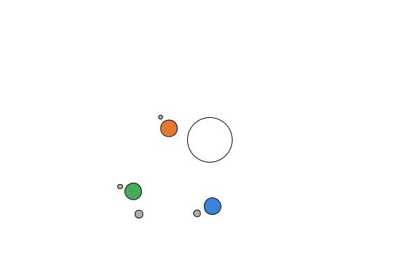

# Sistema Solar — Transformações 2D em Processing

Estudo dirigido de Computação Gráfica: hierarquia Sol → Planeta → Lua com `pushMatrix()`/`popMatrix()`,
`rotate()` e `translate()`, a partir do exemplo do livro *Learning Processing* (cap. 14).

**Como executar:** abra `SistemaSolar/SistemaSolar.pde` na IDE do Processing e clique em *Run*.

| Etapa | Entrega |
|---|---|
| 1 — Leitura guiada e diagrama | [docs/etapa1-diagrama.md](docs/etapa1-diagrama.md) |
| 2 — Fluxo de atualização | [docs/etapa2-update.md](docs/etapa2-update.md) |
| 3 — Extensão | [`SistemaSolar/`](SistemaSolar/): `Planet` passa a ter `Moon[] moons` (o planeta 2 tem duas luas com `distance`, `orbitspeed` e `diameter` diferentes), um campo `color c` por planeta e luas de tamanhos distintos. A janela passou de 480×270 para 600×400 para a lua externa caber na tela. |
| 4 — Relatório | abaixo |

## Relatório

1. **`pushMatrix()`/`popMatrix()`:** em três níveis — no `draw()` em volta do Sol (origem no centro da tela), em `Planet.display()` e em `Moon.display()`.
   Cada par salva o sistema do pai antes de `rotate`/`translate` e o restaura após o desenho, para que o próximo irmão (outro planeta ou a segunda lua) parta do Sol ou do planeta, e não do corpo anterior.
2. **Inverter `rotate()` e `translate()`:** o corpo iria para um ponto fixo a `distance` do pai e só giraria em torno do próprio centro, sem orbitar.
   No planeta, os três ficariam parados em fila à direita do Sol (as luas ainda girariam em volta deles); na lua, ela seguiria o planeta mas sempre parada no lado de fora, alinhada com o Sol.
3. **Órbitas independentes:** cada `Planet`/`Moon` tem o próprio `theta`, `orbitspeed`, `distance` e `diameter`, e seu `update()` só incrementa o próprio `theta` (o planeta apenas chama o `update()` de cada lua do array).
   As matrizes aninhadas fazem a lua herdar a posição do planeta sem alterar o estado dele, e o push/pop de cada corpo impede que sua transformação vaze para os irmãos.
