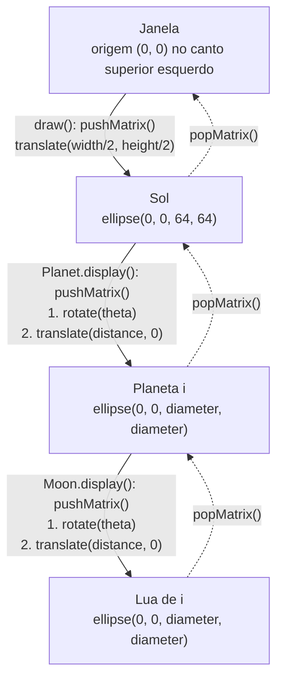
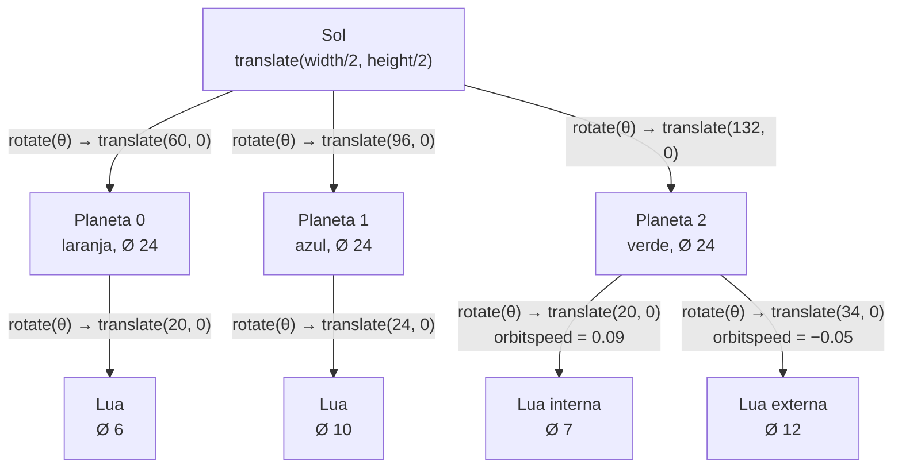

# Etapa 1 — Mapa das transformações (Sol → Planeta → Lua)

Cada seta contínua é "entrar" num nível: `pushMatrix()` seguido das transformações aplicadas
sobre o sistema de coordenadas do nível anterior (a grade se move, não o desenho).
Cada seta tracejada é "sair" dele com `popMatrix()`. Todo corpo é desenhado em `(0, 0)` do seu próprio sistema.

## Diagrama genérico



Matriz acumulada que leva o `(0, 0)` da lua até a tela:

```
M_lua = T(width/2, height/2) · R(theta_planeta) · T(distance_planeta, 0) · R(theta_lua) · T(distance_lua, 0)
```

## Nesta implementação (após a Etapa 3)

Cada seta abaixo fica dentro do seu próprio par `pushMatrix()`/`popMatrix()`, então irmãos
(os três planetas; as duas luas do planeta 2) partem sempre do mesmo sistema do pai.


