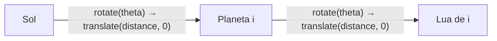

# Etapa 1 — Diagrama das transformações

- O Sol é desenhado no centro da tela: `translate(width/2, height/2)`.
- Cada seta faz a mesma coisa: **gira** (`rotate`) e depois **anda** (`translate`) a partir do corpo anterior.
  Por isso o planeta dá voltas no Sol e a lua dá voltas no planeta.
- Cada seta fica entre `pushMatrix()` e `popMatrix()`, para não afetar o próximo planeta ou a próxima lua.
